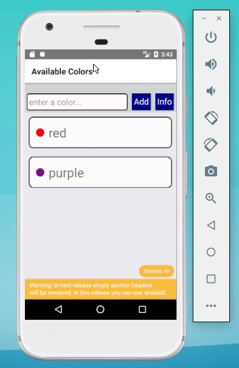

# SCREENSHOTS



# HOW TO RUN

```bash
cd $ANROID_HOME/emulator
emulator -avd Pixel_API_23
```

```bash
react-native start
react-native run-android
```

# STACK

- Respond to touches (event onPress() in <Text>)
- TouchableHighlight
- ScrollView
- ListView
- Collect data (TextInput)
- AsyncStorage
- React navigation
- Navigator (Pending)
- WebView